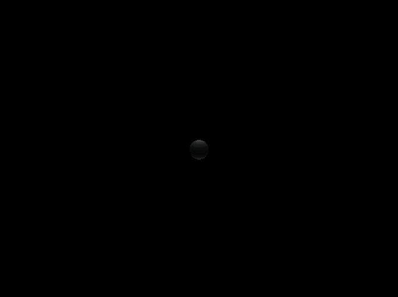

## Extreme-Mass-Ratio Inspirals (EMRIs)
------
  
**FIG 1:** *EMRI with a mass ratio* \(q=3\times 10^{-5}\) *, where red and blue trails are the trajectories for spinning and non-spinning secondary in Kerr spacetime. The orbital parameters are* \((a, p, e, x)=(0.95M,8M, 0.65, \cos(\pi/4))\). *The trajectory of the spinning secondary is governed by the Matthison-Papapetrou-Dixon (MPD) equations, and has dimensionless spin* \(\chi=0.95\).

Extreme-mass-ratio inspirals (EMRIs) are binary systems with mass ratio \(q\gtrsim 10^{-5}\), consisting of a stellar/intermediate-mass secondary (i.e. black holes (BHs), neutron stars (NSs), white dwarfs (WDs), etc.) are gravitationally bound to a massive black hole (MBH) of mass \(M\gtrsim 10^{5}M_{\odot}\). These systems are 
