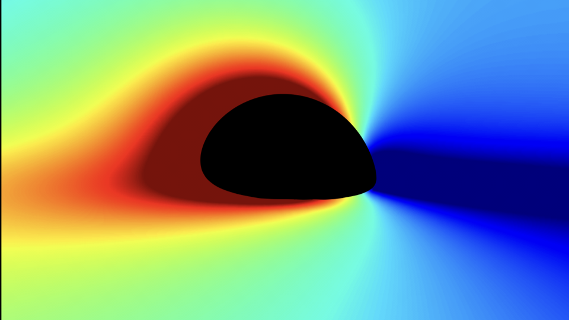

  
*FIG 1. g-factor (energy-shift) contour showing the black-hole shadow.*

I like solving puzzles, so physics is the natural place to harness my creative energy. I enjoy learning new mathematical techniques and applying to real-life systems. Currently, my main research area is black-hole (BH) physics, but from time to time, I do enjoy learning some other interesting areas in physics like fluid dynamics, electrodynamics, complex systems, etc. The most exciting part is when I get to integrate ideas that I learn from other disciplines with my research on BHs. Below, I provide an overview of my current projects, and some thoughts that keep me up at night...

## Extreme-Mass-Ratio Inspirals (EMRIs)
------

*FIG. 2: EMRI with mass ratio* \\(q=5\times 10^{-6}\\) *, where red and blue trails are the trajectories for spinning and non-spinning secondary in Kerr spacetime, respectively. The orbital parameters are* \\((a, p, e, x)=(0.95M,8M, 0.65, \cos(\pi/4))\\). *The trajectory of the spinning secondary is governed by the Matthison-Papapetrou-Dixon (MPD) equations, and has dimensionless spin* \\(\chi=0.95\\).

Extreme-mass-ratio inspirals (EMRIs) are binary systems with mass ratio \\(q\lesssim 10^{-5}\\), consisting of a stellar/intermediate-mass secondary (i.e. black holes (BHs), neutron stars (NSs), white dwarfs (WDs), etc.), gravitationally bound to a massive black hole (MBH) of mass \\(M\gtrsim 10^{5}M_{\odot}\\). For orbital motion on short timescales, we typically opt for the test particle approximation. That is, we assume that the secondary's self-gravity is small and negligible when considering orbits over a few cycles. However, EMRIs can have orbital timescales of the order of ~1000 years, so the small corrections due to the secondary's self-gravity can accumulate over long timescale to produce large deviations in the orbital morphology. These small changes in the orbit are modelled using BH perturbation and self-force (SF) theory. This is where we take the exact, analytical Kerr solution for spinning BHs, and perturb this solution by deforming the spacetime due to the secondary's self-gravity. This is done by solving the Teukolsky equation and adding a self-force term to the geodesic equation. In FIG. 2, we compare the orbital evolution for an EMRI with a spinning (red trail) versus a non-spinning secondary (blue trail), where the former evolves due to gravitational radiation and spin-curvature coupling, and solely evolves due to gravitational radiation. We can clearly see how small secular evolutions can change the orbit over long timescales!

## Gravitational Wave (GWs) from EMRIs
------
As seen in FIG. 2, EMRIs have complex orbits, but what makes them so remarkable is their gravitational-wave (GW) signals. These systems are the primary targets for space-based millihertz gravitational-wave (GW) detectors such as LISA, TianQin, and Taiji.

## Environmental Effects (EEs) on EMRI GWs
